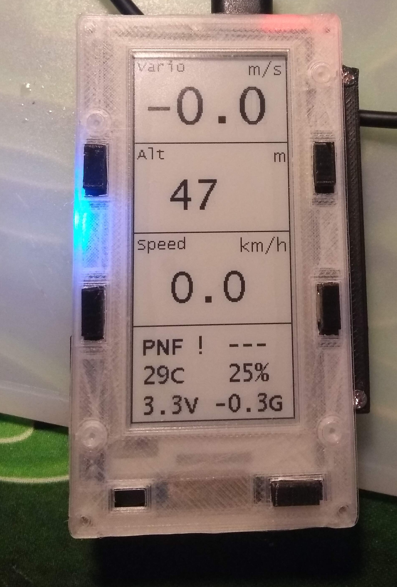
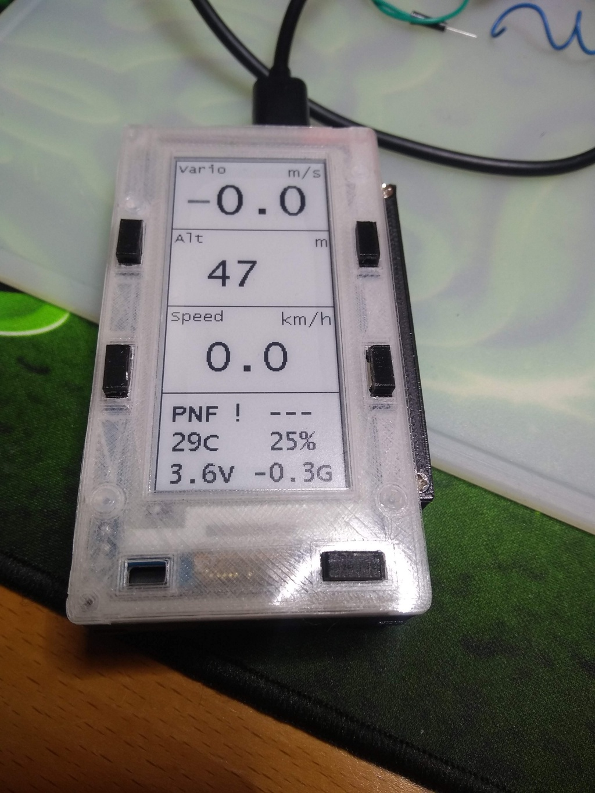
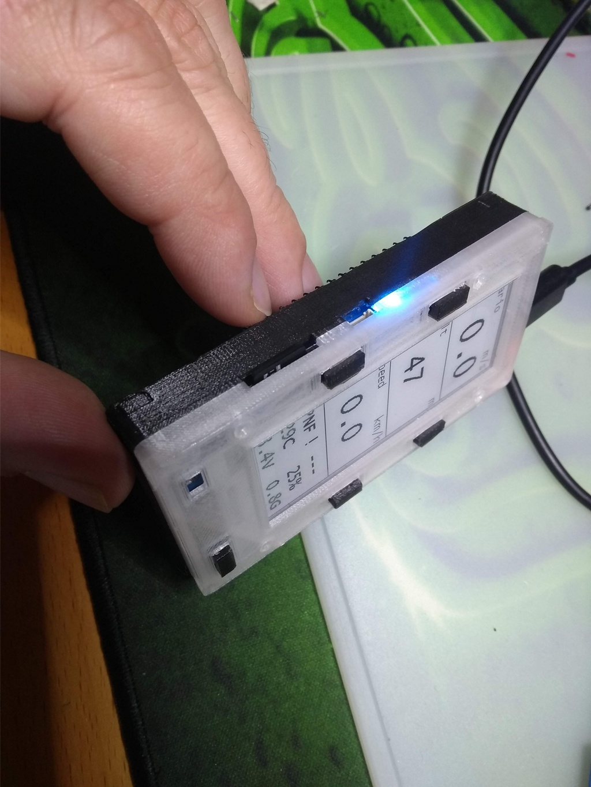
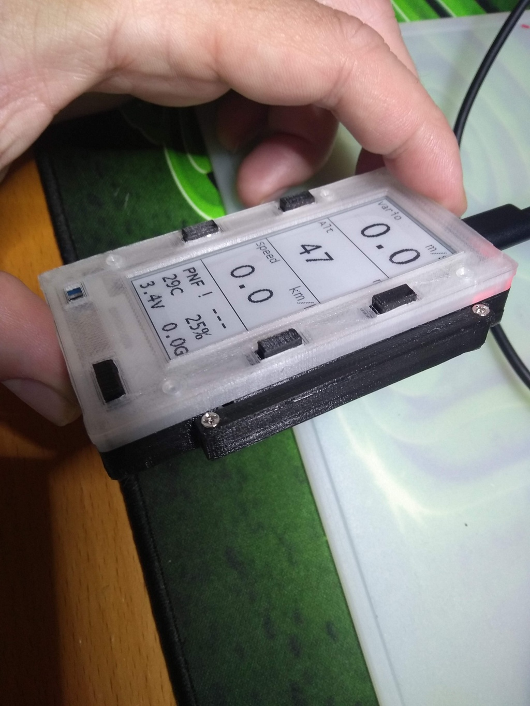
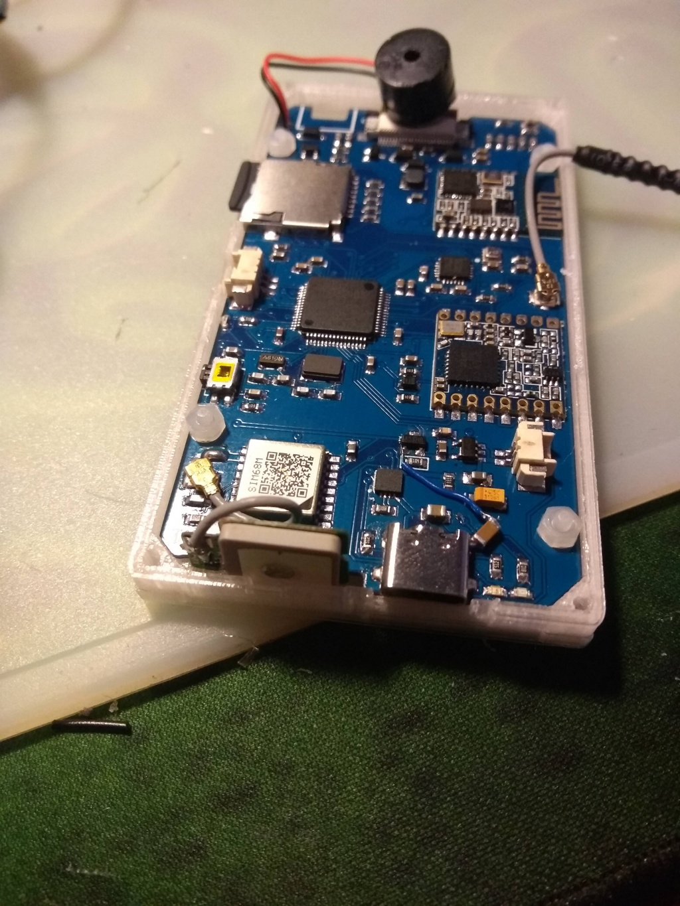

# FreeVario
Freevario is an opensource device to provides telemetry data to any vario based program such as XCSoar or XCTrack via bluetooth or USB. It's a custom build board featuring:

  STM32F405 processor
  E-Ink display
  GNSS module
  BMP280 presure sensor
  mpu6050 motion sensor
  HM13 bluetooth module
  SX1276 Lora Modem (for FANET)
  SDcard reader
  Piezo output
  USB-C connector for OTG and charging
  

The firmware runs on FreeRtos and STM32 HAL drivers. 

  
 
     
  

  
  
 
     
  

    
 
    
  

